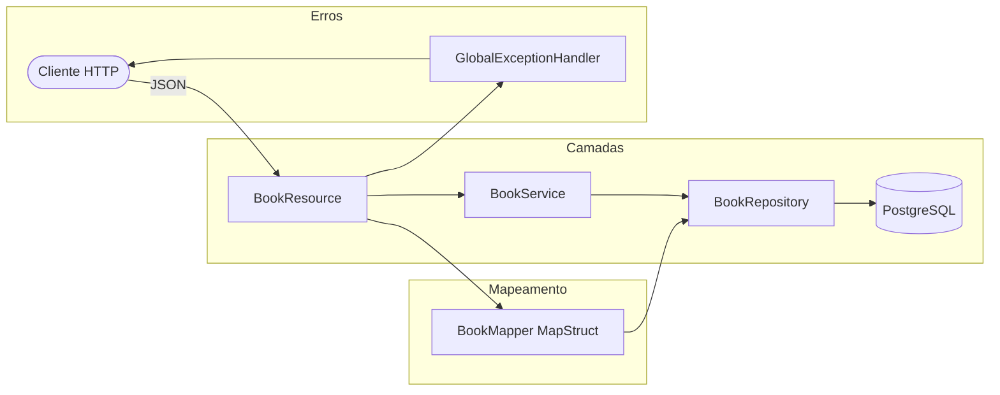

# api-livros

API REST CRUD de livros com arquitetura em camadas, mapeamento via **MapStruct**, tratamento global de exceções cobrindo **todos os códigos HTTP** (1xx–5xx), interfaces genéricas reutilizáveis e configuração 12-factor.

[](https://openjdk.org/projects/jdk/17/)
[](https://spring.io/projects/spring-boot)
[](https://www.postgresql.org/)
[](https://mapstruct.org/)
[](http://localhost:8080/swagger-ui.html)
[](LICENSE)

---

## Arquitetura



---

## Destaques Técnicos

### GlobalExceptionHandler — cobertura completa de HTTP
O `@ControllerAdvice` mapeia handlers individuais para **cada família de código HTTP**, retornando um `ErrorResponse` padronizado com status, mensagem e stack trace opcional:

```java
// 4xx
@ExceptionHandler(CustomHttpException.NotFoundException.class)
→ 404 com mensagem descritiva

@ExceptionHandler(CustomHttpException.BadRequestException.class)
→ 400 com mensagem descritiva

// 5xx
@ExceptionHandler(CustomHttpException.InternalServerErrorException.class)
→ 500 com mensagem descritiva

// Genérico — captura qualquer exceção não mapeada
@ExceptionHandler(Exception.class)
→ 500 com "Erro interno no servidor"
```

### Feature Toggle — stack trace controlado por configuração
```yaml
feature:
  toggle:
    print-stacktrace: false  # true em dev, false em prod
```
O stack trace só é incluído na resposta quando a flag está ativa — sem recompilar.

### MapStruct — mapeamento gerado em tempo de compilação
```java
@Mapper(componentModel = "spring")
public interface BookMapper {
    BookDto    toDto(BookModel entity);
    BookModel  toModel(BookDto dto);
    List<BookDto>   toDtoList(List<BookModel> all);
    List<BookModel> toModelList(List<BookDto> all);
}
```
Zero reflection em runtime — o código de mapeamento é gerado pelo processador de anotações.

### Interfaces Genéricas
```java
// Contrato único para todos os controllers
IResource<T, N>  →  create / get(id) / get() / update / delete

// Contrato único para todos os services
IService<T, N>   →  create / read(id) / read() / update / delete
```

---

## Stack

| Tecnologia | Versão | Uso |
|---|---|---|
| Java | 17 | Linguagem principal |
| Spring Boot | 3.4.0 | Framework web |
| Spring Data JPA | — | Persistência ORM |
| PostgreSQL | — | Banco de dados |
| MapStruct | 1.6.3 | Mapeamento Model ↔ DTO |
| Lombok | 1.18.34 | `@Slf4j`, `@SneakyThrows` |
| Springdoc OpenAPI | 2.7.0 | Swagger UI |

---

## Como Executar

### Com Docker (recomendado)
```bash
git clone https://github.com/odavid062/n2Webservice.git
cd n2Webservice
docker compose up --build
```

| Serviço | URL |
|---|---|
| API | http://localhost:8080 |
| Swagger UI | http://localhost:8080/swagger-ui.html |
| PostgreSQL | localhost:5432 |

### Com Maven
```bash
cd n2Webservice
./mvnw spring-boot:run
```

Configure as variáveis de ambiente antes de executar:
```bash
export DATABASE_JDBC_URL=jdbc:postgresql://localhost:5432/postgres
export DATABASE_USERNAME=postgres
export DATABASE_PASSWORD=sua_senha
```

---

## Endpoints

| Método | Rota | Descrição |
|---|---|---|
| `POST` | `/api/v1/books` | Cria um novo livro |
| `GET` | `/api/v1/books` | Lista todos os livros |
| `GET` | `/api/v1/books/{id}` | Busca livro por ID |
| `PUT` | `/api/v1/books/{id}` | Atualiza livro |
| `DELETE` | `/api/v1/books/{id}` | Remove livro |

### Exemplos

```bash
# Criar livro
curl -X POST http://localhost:8080/api/v1/books \
  -H "Content-Type: application/json" \
  -d '{"nome": "Clean Code", "descricao": "Boas práticas de programação"}'

# Listar todos
curl http://localhost:8080/api/v1/books

# Buscar por ID
curl http://localhost:8080/api/v1/books/1

# Atualizar
curl -X PUT http://localhost:8080/api/v1/books/1 \
  -H "Content-Type: application/json" \
  -d '{"nome": "Clean Code", "descricao": "Robert C. Martin"}'

# Deletar
curl -X DELETE http://localhost:8080/api/v1/books/1
```

---

## Estrutura do Projeto

```
src/main/java/br/go/senac/ads4/
├── interfaces/
│   ├── IResource.java              # Contrato genérico para controllers
│   └── IService.java               # Contrato genérico para services
├── model/
│   └── BookModel.java              # Entidade JPA (id, nome, descricao)
├── dto/
│   └── BookDto.java                # DTO de transferência
├── mapper/
│   └── BookMapper.java             # MapStruct: BookModel ↔ BookDto
├── repository/
│   └── BookRepository.java         # Spring Data JPA
├── service/
│   └── BookService.java            # Implementa IService<BookDto, Integer>
├── resource/
│   └── BookResource.java           # Implementa IResource<BookDto, Integer>
├── handler/
│   ├── GlobalExceptionHandler.java # @ControllerAdvice — todos os HTTP codes
│   └── ErrorResponse.java          # Resposta padronizada de erro
└── exception/
    ├── CustomHttpException.java     # Hierarquia de exceções por código HTTP
    └── CustomErrorException.java
```

---

## Autor

**David Rodrigues**
[](https://github.com/odavid062)
